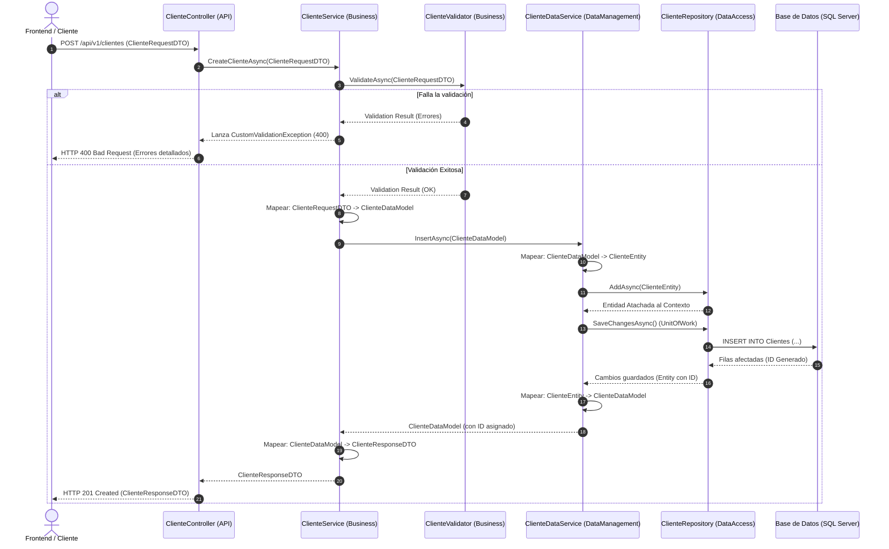
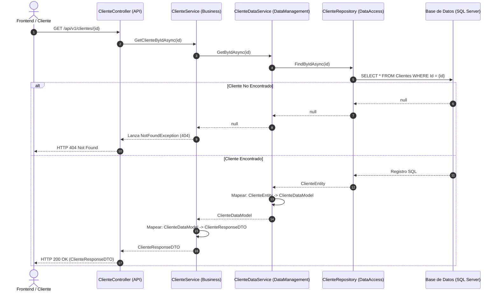
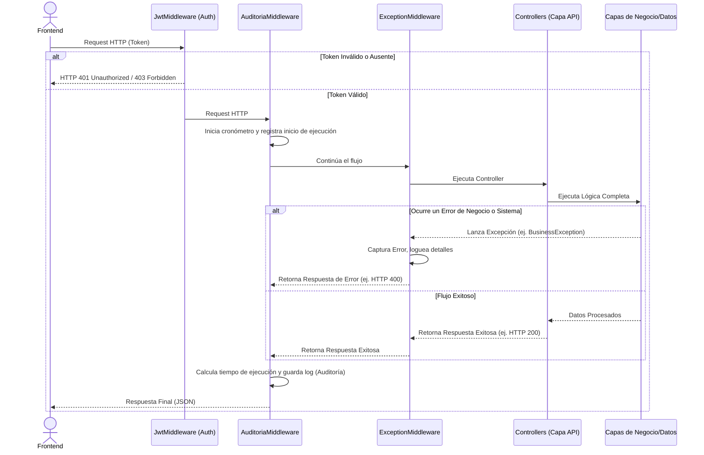

# Diagramas de Secuencia: Arquitectura Backend (MicroservicioAutos)

A continuación, se presentan los diagramas de secuencia que ilustran el flujo de las peticiones a través de las diferentes capas del proyecto `.NET 8`. Estos diagramas están diseñados para ser copiados o exportados como imágenes para tu documento de Word.

---

## 1. Flujo de Creación de un Registro (Ejemplo: Módulo de Clientes)

Este diagrama detalla paso a paso cómo viaja la información desde que el usuario envía los datos para crear un nuevo Cliente, pasando por todas las capas de validación, lógica de negocio y finalmente guardándose en la base de datos SQL.

---

## 2. Flujo de Consulta / Listado (Ejemplo: Obtener Cliente por ID)

Este diagrama ilustra una lectura de base de datos. Es un flujo más directo y rápido, ya que usualmente no requiere validaciones de guardado complejas, aunque sí pasa por las capas arquitectónicas para respetar el diseño.

---

## 3. Funcionamiento Global de un Request (Intervención de Middlewares)

Este diagrama es útil para documentar cómo la arquitectura maneja aspectos transversales (Errores y Auditoría) antes de llegar a los Controladores de la API.

